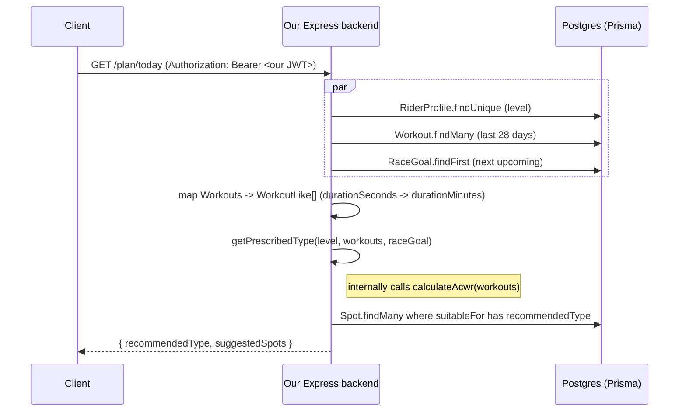

# Plan matching (`GET /plan/today`)

`GET /plan/today` decides what training intensity a rider should do today and
returns the `Spot`s that match it. The decision logic lives in
`src/services/planService.ts` as two pure, database-free functions
(`calculateAcwr`, `getPrescribedType`) — this doc explains the reasoning
behind each piece; the actual thresholds live as named constants at the top
of that file.

## Flow



## Why this is a pure service, not inline route logic

Per `docs/plan.md` step 9 and `CLAUDE.md`'s routes → controllers → services
layering rule, `planService.ts` takes no `prisma` import and does no I/O.
`plan.controller.ts` does all the fetching and shape conversion; the service
only ever sees plain `{ date, type, durationMinutes }` objects
(`WorkoutLike`), not the real `Workout` model. That keeps the actual
matching *rules* testable without a database (see Tests below) and reusable
later — e.g. a "what would today look like" preview — without duplicating
logic into a second route.

## `calculateAcwr` — training load trend

```
load(workout) = durationMinutes × INTENSITY_WEIGHT[type]   (RECOVERY=1, ENDURANCE=2, INTERVAL=4)
acuteLoad     = sum of load for workouts in the last 7 days
chronicLoad   = sum of load for workouts in the last 28 days, ÷ 4 (→ a weekly rate)
acwr          = acuteLoad / chronicLoad
```

This is the standard acute:chronic workload ratio from sports science: how
this week's training stress compares to the athlete's recent normal. An ACWR
at or above `ACWR_OVERREACHING_THRESHOLD` (1.3) is the conventional signal
for "load is ramping up too fast, injury/overreaching risk."

`calculateAcwr` returns `null` instead of a number in two cases:

- **Thin history** — fewer than `MIN_HISTORY_DAYS` (14) between the earliest
  workout in the input and now, or no workouts at all.
- **No chronic load** — `chronicLoad === 0`, which would otherwise divide by
  zero.

### Why ACWR needs the history fallback

A 28-day chronic average built from 3 days of rides isn't a baseline, it's
noise — `calculateAcwr` is right to refuse to guess rather than return a
misleading ratio. But "we can't compute ACWR" is not the same as "this rider
is safe to go hard." A brand-new user who just connected Strava and
immediately logged two interval days in the last 3 days is showing the exact
overreach *pattern* ACWR would normally catch — there just isn't 4 weeks of
chronic data yet to prove it with a ratio.

`getPrescribedType`'s branch 4 exists to cover exactly that gap: when
`calculateAcwr` returns `null`, fall back to a much cheaper, direct signal —
a raw count of recent `INTERVAL` workouts (`RECOVERY_GUARD_LOOKBACK_DAYS`,
default 3 days). Two or more recent hard efforts with no ACWR to check them
against is enough to prescribe `RECOVERY`. Without this branch, every new
rider would get zero overreaching protection for their first two weeks on
the app — precisely the window `calculateAcwr` can't cover.

## `getPrescribedType` — five branches, first match wins

| # | Condition | Result | Why it's checked here |
|---|-----------|--------|------------------------|
| 1 | `level === CASUAL` or `level === null` | `ENDURANCE` | Checked first, no exceptions. A casual or not-yet-configured rider is never bumped to `RECOVERY`/`INTERVAL` by anything below — the safest possible default for an athlete we know little about. |
| 2 | Race goal within `TAPER_DAYS_BEFORE_RACE` (5) days | `RECOVERY` | Tapering before a race goal always wins over load/level — you don't want a hard interval session two days before race day even if ACWR looks fine. |
| 3 | `acwr !== null && acwr >= ACWR_OVERREACHING_THRESHOLD` (1.3) | `RECOVERY` | The real overreaching signal, once there's enough history to trust it. |
| 4 | `acwr === null` and 2+ `INTERVAL` workouts in the last `RECOVERY_GUARD_LOOKBACK_DAYS` (3) days | `RECOVERY` | The history fallback described above. |
| 5 | otherwise | `MID → ENDURANCE`, `RACING → INTERVAL` | The level-based default once nothing else has flagged a reason to back off. |

## Response shape

`prisma.spot.findMany({ where: { suitableFor: { has: recommendedType } } })`
— no `take` limit, every matching `Spot` (with its `notes`, a plain scalar
column) comes back. Response: `{ recommendedType, suggestedSpots }`.

## Tests

`src/services/planService.test.ts` (Vitest — `npm run test` /
`npx vitest run`) exercises `calculateAcwr` and `getPrescribedType` directly
with hand-built `WorkoutLike[]` histories, no database involved:

- `calculateAcwr`: empty history → `null`; thin history (< 14 days span) →
  `null`; a steady-state 28-day history → ratio ≈ 1.0; the same history plus
  a recent hard spike → ratio ≈ 2.0.
- `getPrescribedType`, one case per branch above, including:
  - branch 1 with a fabricated *overreaching* history, to prove `CASUAL`
    really has "no exceptions"
  - branch 4 with a thin (2-day) history and two recent `INTERVAL`
    workouts — the fallback rule firing correctly, with `calculateAcwr`
    asserted to be `null` first so the test proves the fallback path is
    actually the one being exercised
  - a branch 4 *negative* case (thin history, only 1 recent `INTERVAL`
    workout) confirming the "2+" threshold is enforced, not "any"

## Relevant files

- `src/services/planService.ts` — `calculateAcwr`, `getPrescribedType`,
  `WorkoutLike`, and all the tunable threshold constants at the top of the
  file
- `src/services/planService.test.ts` — the unit tests described above
- `src/controllers/plan.controller.ts` / `src/routes/plan.routes.ts` —
  `GET /plan/today`, the DB fetch + `WorkoutLike` mapping, and the `Spot`
  query
- `prisma/schema.prisma` — `RiderProfile.level`, `Workout.date/type/
  durationSeconds`, `RaceGoal.date`, `Spot.suitableFor`
