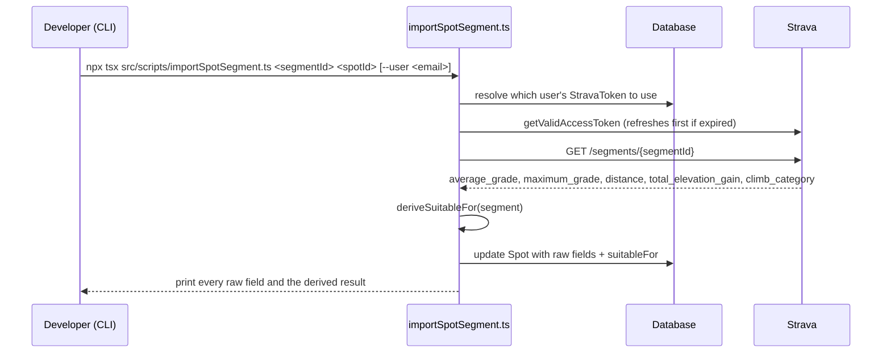

# Spot segment import (Milestone 7a)

`Spot` now carries real climb data pulled directly from Strava segments —
grade, length, elevation gain, Strava's own 0-5 climb rating — plus a derived
`suitableFor` field saying which `WorkoutType`s the spot is good for. This
doc covers the schema, the import script, the derivation rules, and the real
data-quality issues hit while populating it. The thresholds live as named
constants at the top of `src/scripts/importSpotSegment.ts`; this is the
reasoning behind them.

## Schema

| Field | Type | Meaning |
|---|---|---|
| `averageGradePercent` | `Float?` | Strava's `average_grade` — net rise/run over the whole segment. |
| `maxGradePercent` | `Float?` | Strava's `maximum_grade` — steepest short stretch within the segment. |
| `distanceMeters` | `Float?` | Segment length. |
| `elevationGainMeters` | `Float?` | Strava's `total_elevation_gain` — computed from the actual elevation profile (accounts for rollers), not `elevation_high - elevation_low`. |
| `climbCategory` | `Int?` | Strava's own 0-5 climb rating. Stored for reference only — it does not feed `suitableFor`. |
| `suitableFor` | `WorkoutType[]` | Derived by the import script (see below). Defaults to `[]`. |
| `notes` | `String?` | Free text. Used so far to document manual corrections to Strava's raw data (see below). |
| `difficulty` | `SpotDifficulty?` | Made optional in this migration — nothing in hand-written code reads it yet, only Prisma's generated code. Still unset on every seeded spot. |

`Spot.name` is `@unique`, which is what lets `prisma/seed.ts` use a plain
`upsert` and stay safe to re-run.

## Flow

## How `suitableFor` is derived

Two independent, stacking checks can each add `INTERVAL` — a spot can pick
up `INTERVAL` from either path plus one of `RECOVERY`/`ENDURANCE` at the same
time, not one exclusive bucket:

1. **Sustained climb** — `average_grade ≥ MIN_GRADE_FOR_INTERVAL` (5%) **and**
   `distance ≥ MIN_LENGTH_FOR_INTERVAL_METERS` (500m). Catches climbs that
   are steep *as a whole*, long enough to be a structured hard effort in one
   shot (e.g. Sampaloc Climb FULL, Bagong Tubig).
2. **Repeats climb** — `distance ≤ MAX_LENGTH_FOR_REPEATS_METERS` (3000m)
   **and** `elevationGain / (distance/1000) ≥ REPEATS_MIN_GAIN_PER_KM`
   (25 m/km). Added after Cardiac Hill was misclassified: its average grade
   (4.2%) never clears the sustained-climb threshold because it's short
   enough that the grade dilutes fast, but it's exactly the kind of short,
   steep hill people lap as repeats. Judged on gain-per-km instead of
   average grade over the whole segment for that reason.

Then, independently:

3. **Flat check** — `elevationGain / (distance/1000) < FLAT_ELEVATION_GAIN_PER_KM_THRESHOLD`
   (15 m/km) adds `RECOVERY` + `ENDURANCE`; otherwise just `ENDURANCE`.

All five constants are untuned starting points — chosen to cleanly separate
the ~12 real spots imported so far (rolling loops vs. short punchy climbs vs.
long sustained ones), not calibrated against a larger dataset. Retune
directly in `importSpotSegment.ts` if they misclassify a spot once more are
imported — same caveat `strava.service.ts`'s own thresholds carry.

## Strava's raw data isn't always trustworthy

The import script pulls Strava's fields directly with no parsing — but two
real anomalies turned up importing the first 12 spots, both physically
inconsistent with the segment's own other fields, not code bugs:

- **Route 111 Challenge**: `maximum_grade` came back as **375%** — not
  physically possible (100% is already a 45° wall). Almost certainly a GPS
  elevation spike somewhere along a 111km segment. Manually corrected to
  **23%** (the rider's own knowledge of the climb).
- **Cardiac Hill**: `total_elevation_gain` came back as **0m** despite an
  `average_grade` of 4% over a 2.38km segment — those two numbers don't
  reconcile with each other (a real 4% grade over that distance implies
  roughly 95m of gain, not 0). Manually corrected to the rider-supplied real
  numbers (2.53km / 112m gain / 4.2% average), with `suitableFor` recomputed
  by hand using the same rules above.

**The fix pattern**: correct the specific field(s) directly on the `Spot`
row, recompute `suitableFor` consistent with the derivation rules, and leave
a `notes` entry stating what was changed and why. This matters because
re-running `importSpotSegment.ts` against the same segment always refetches
from Strava and will silently overwrite a manual correction on every field
it writes — `notes` is the one field it never touches, so it's the only
place a future re-run won't clobber the explanation.

## Picking which Strava account's token to use

The script has no HTTP request or JWT to carry a user id — it's a CLI tool.
`resolveUserId` looks up the single row in `StravaToken` and uses it,
erroring out (telling you to pass `--user <email>`) if there are zero or
more than one. Simple by design for the current one-connected-account reality;
not meant to guess silently if that ever changes.

## Seeding

`prisma/seed.ts` creates base `Spot` rows (name + terrainType only — every
other field stays null until `importSpotSegment.ts` runs against it).
Wired via `prisma.config.ts`'s `migrations.seed`, not `package.json` — this
repo is on Prisma 7, which reads seed config from the config file and no
longer auto-runs the seed after `migrate dev`. Run it explicitly:
`npx prisma db seed`.

## Relevant files

- `prisma/schema.prisma` — the `Spot` model fields above
- `prisma.config.ts` — `migrations.seed` wiring
- `prisma/seed.ts` — base spot rows
- `src/scripts/importSpotSegment.ts` — `resolveUserId`, `deriveSuitableFor`,
  `main` (the orchestration), and all the tunable threshold constants at the
  top of the file
- `src/services/strava.service.ts` — `getValidAccessToken` (exported so the
  script can reuse the existing refresh-before-fetch logic)
