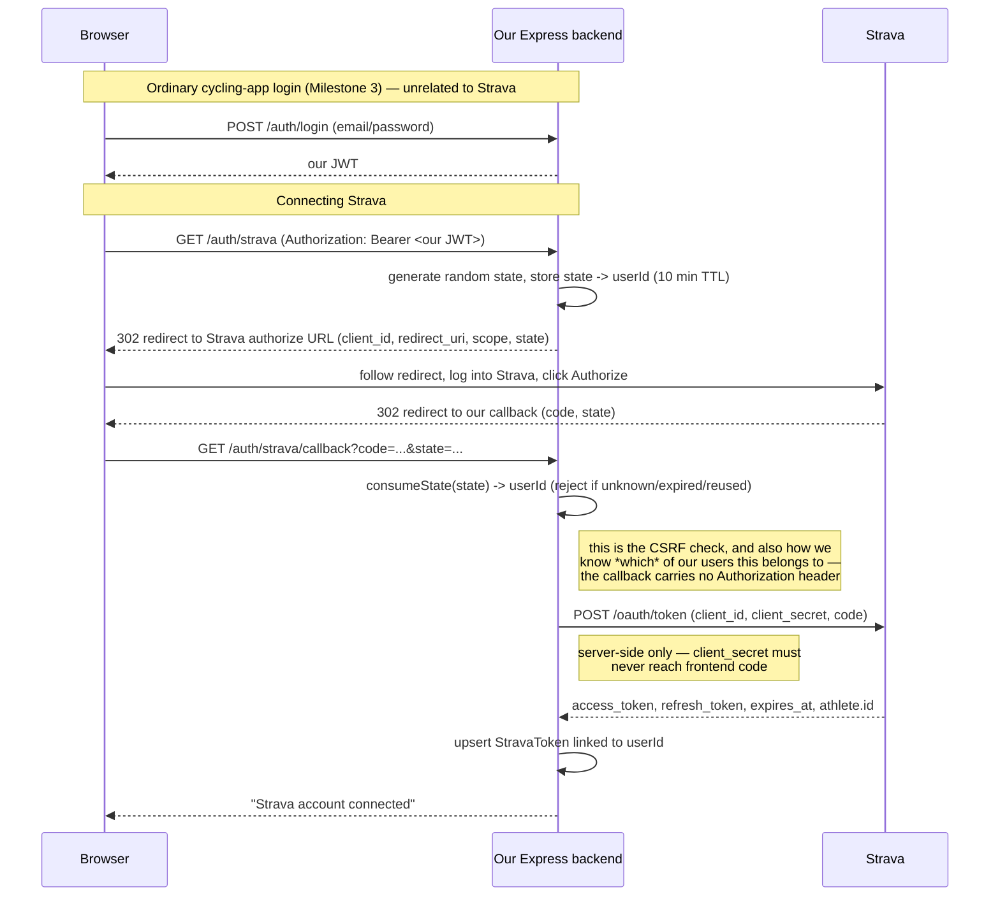

# Strava OAuth connect (Milestone 5)

## Two separate identity systems

It's easy to conflate these, so worth stating plainly: **our app's login and
your Strava account are two independent systems**, linked only by the
`StravaToken` table.

- **cycling-app auth** (`User` table, Milestone 3) — email + password we
  control, verified with bcrypt, sessions represented as our own JWT. This is
  who you are *in our app*.
- **Strava account** — you have exactly one, the one you log into
  strava.com with. Registering a "Strava API app" at
  strava.com/settings/api does not create a new Strava account; it registers
  *our backend* as a client allowed to request access to Strava accounts,
  identified by a `Client ID` / `Client Secret` pair. It's the same pattern
  as any "Sign in with Google" button — the website has a registered Google
  API app, but you're still using your one Google account.

`StravaToken` is the bridge: one row per **our** user, holding the
access/refresh tokens *their* Strava account granted us.

## Flow

## Why the state check matters

`GET /auth/strava/callback` is a plain browser redirect from Strava — it
carries no `Authorization` header, so it can't be protected by our normal
`requireAuth` middleware. The `state` value generated in `/auth/strava`
serves two purposes at once:

1. **CSRF protection** — proves this callback traces back to a redirect we
   actually issued, not a forged request with someone else's authorization
   `code`.
2. **User identification** — since there's no JWT to read, `state` is the
   only way to recover which of our users this Strava connection belongs to.

States are single-use (deleted the moment they're looked up) and expire
after 10 minutes, so a leaked or replayed callback URL can't be reused.

## Why the token exchange happens server-side

The final step — exchanging Strava's `code` for real access/refresh tokens —
requires our `client_secret`. That must stay in the Express server's env
vars and never be embedded in frontend code, since anything shipped to the
browser is fully visible in dev tools. This is also why `/auth/strava/callback`
does the exchange itself rather than handing `code` back to the frontend to
exchange — the frontend never touches the secret at all.

## Relevant files

- `src/lib/stravaState.ts` — the in-memory `state -> userId` store
- `src/lib/strava.schema.ts` — zod validation for the callback's query params
- `src/services/strava.service.ts` — authorize URL, token exchange, `StravaToken` upsert
- `src/controllers/strava.controller.ts` / `src/routes/strava.routes.ts` — `GET /auth/strava` and `GET /auth/strava/callback`
