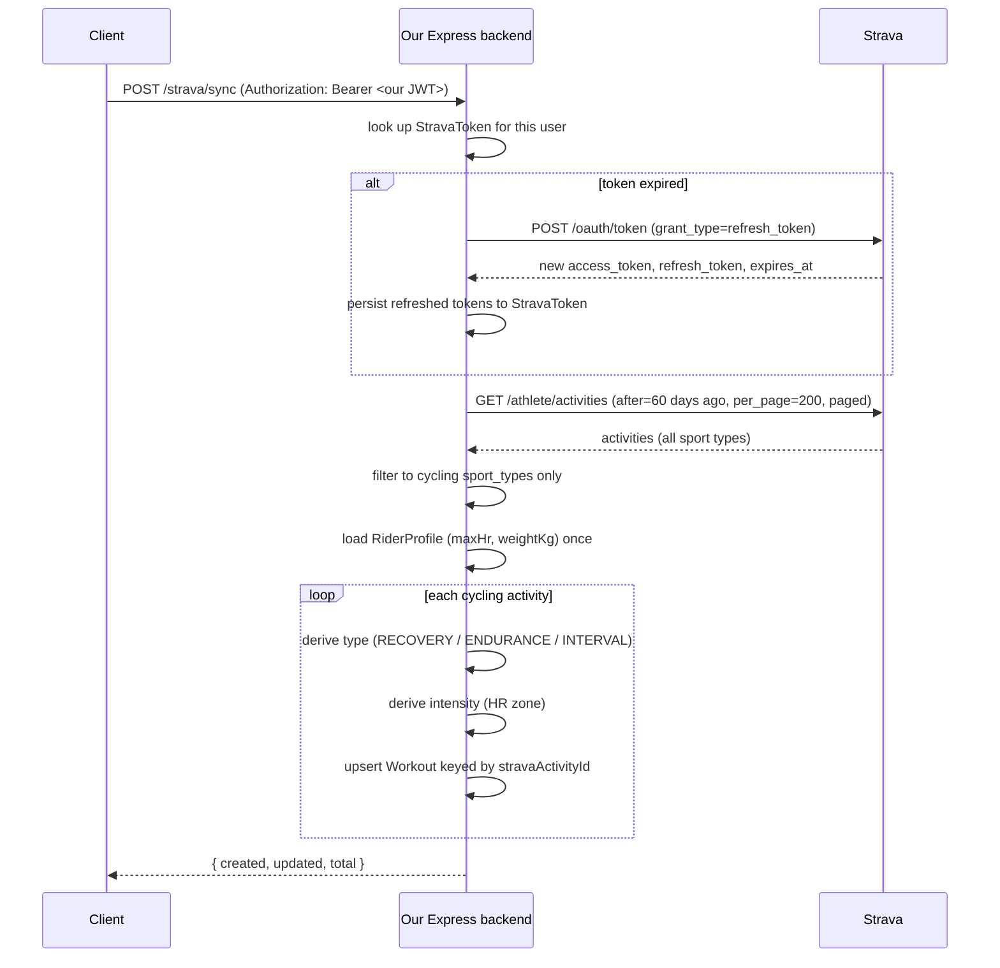

# Strava activity sync (Milestone 6)

`POST /strava/sync` pulls the last 60 days of the connected rider's cycling
activities from Strava and upserts them into `Workout`. This doc covers how
each derived field gets its value and why — the actual thresholds live as
named constants at the top of `src/services/strava.service.ts`, this is the
reasoning behind them.

## Flow

## Refresh-before-fetch

`getValidAccessToken` compares `StravaToken.expiresAt` to now before every
sync. Strava access tokens are short-lived (hours, not days), so without this
check, sync would work right after connecting and then start failing with
401s a few hours later until the rider manually reconnected. If expired, it
exchanges the stored `refreshToken` for a new token pair and saves it back to
`StravaToken` before doing anything else — every other function in the file
only ever sees a token guaranteed to still be valid.

## Why upsert is keyed by `stravaActivityId`

Sync is meant to be safely re-run — daily, or by hitting the button twice in
a row. Keying the upsert on `stravaActivityId` (globally unique per Strava
activity, so `userId` doesn't need to be part of the key) means re-syncing
never creates duplicate rows: an activity we already have gets its data
refreshed in place instead.

## How `type` is classified

`WorkoutType` is `RECOVERY | ENDURANCE | INTERVAL` — no duration-based value.
Earlier drafts included `LONG_RIDE` and `RACE`, both removed:

- **`LONG_RIDE` was dropped** because duration and effort are different
  axes — a 120km ride at steady endurance pace is genuinely *both* long and
  endurance-paced, and forcing that into one exclusive category always
  throws away one of the two truths. `Workout.distanceMeters` already
  captures ride length losslessly, so anything that needs "was this long"
  (a future calendar badge, load calculations) reads that column directly
  instead of going through `type`.
- **`RACE` was dropped** because Strava's activity data has no signal for
  "this was a race" at all — nothing to derive it from.

Both stay reachable only through manual entry, once that exists.

`deriveWorkoutType` checks, in order:

1. **`RECOVERY`** — `average_speed` (converted to km/h) ≤
   `RECOVERY_MAX_AVG_SPEED_KMH` (22) **and** `distance` <
   `RECOVERY_MAX_DISTANCE_METERS` (30km). Both conditions, not either —
   distance alone would over-match short hard efforts, speed alone would
   over-match long lazy ones.
2. **`INTERVAL`** — `isHardEffort` returns true (see below).
3. **`ENDURANCE`** — the fallback, and a real classification now (not a
   placeholder): anything that isn't recovery-paced and isn't unusually hard
   for its duration genuinely is a standard endurance ride.

### `isHardEffort` — the two-signal fallback chain

"Was this ride unusually hard for its length" is approximated two ways,
preferring whichever signal the activity actually has data for:

1. **`suffer_score` per hour ≥ `INTERVAL_SUFFER_SCORE_PER_HOUR` (70)** —
   preferred. `suffer_score` is Strava's own HR-derived "Relative Effort,"
   already calibrated to the athlete's own heart-rate zones. Scaled to a
   per-hour rate so a short hard ride and a long hard ride are compared
   fairly (raw `suffer_score` grows with duration on its own).
2. **`average_watts / RiderProfile.weightKg` ≥ `INTERVAL_WATTS_PER_KG`
   (3.0)** — fallback, used only when the activity has no HR data (so no
   `suffer_score` either). `average_watts` comes from a real power meter, or
   from Strava's own speed/grade-based estimate ("virtual power") when
   there's no meter — either way it's a raw watts number, and 250W means
   something very different for a 55kg rider than a 95kg one, so it's
   normalized by the rider's own weight before comparing against the
   threshold. Requires `RiderProfile.weightKg` to be set — if it isn't, this
   fallback can't fire and the ride falls through to `ENDURANCE`.

If neither signal is available, the ride is `ENDURANCE` by default — not
because it's known to be easy, just because there's no data suggesting
otherwise.

**Known limitation**: neither signal sees the actual on/off *shape* of an
effort (e.g. "2 min hard, 2 min easy, repeated"). That would require Strava's
per-activity Streams API — one extra HTTP call per ride, which was ruled out
during planning as too expensive against Strava's rate limits (100
requests/15min) for what a 60-day sync would need. Both signals really
detect "this was hard," which is a reasonable proxy for "this was probably
structured as intervals" but not the same thing — a continuous, non-stop
threshold effort with zero rest can trigger the same signal.

**Both thresholds (`70`/hour and `3.0` W/kg) are starting points**, not
calibrated against real training data — validated only by checking that they
produced a clean separation (no borderline cases) against one real rider's
46-activity sync history. Retune the constants directly in
`strava.service.ts` if they misclassify real rides once more people are
using this.

## How `intensity` is classified

`deriveIntensityZone` buckets `average_heartrate` as a fraction of
`RiderProfile.maxHr` into the five `IntensityZone` values, using standard
%-of-max-HR training zone bands:

| `avgHeartRate / maxHr` | Zone        |
|-------------------------|-------------|
| < 60%                   | `RECOVERY`  |
| < 70%                   | `ENDURANCE` |
| < 80%                   | `TEMPO`     |
| < 90%                   | `THRESHOLD` |
| ≥ 90%                    | `VO2MAX`    |

Falls back to `ENDURANCE` if either `average_heartrate` (Strava may not have
it) or `RiderProfile.maxHr` (optional field, not always filled in) is
missing. There's no power-based fallback here the way there is for `type` —
turning power into a zone needs a threshold-power (FTP) reference, which
`RiderProfile` doesn't have a field for.

## Both fallbacks depend on `RiderProfile` being filled in

Neither the `type` power fallback nor `intensity` works without the rider
having entered `weightKg` / `maxHr` via `PUT /profile` — connecting Strava
(Milestone 5) only ever stores OAuth tokens, it never imports profile data
from the athlete's actual Strava account (that would need a broader OAuth
scope than the `activity:read_all` this app requests). So a fully-connected
account with no profile filled in will still get `ENDURANCE` defaults across
the board until the rider fills in their profile — a data-completeness gap,
not a code bug.

## Relevant files

- `src/services/strava.service.ts` — `getValidAccessToken`,
  `fetchRecentActivities`, `deriveWorkoutType`, `isHardEffort`,
  `deriveIntensityZone`, `syncStravaActivities` (the orchestration), and all
  the tunable threshold constants at the top of the file
- `src/controllers/strava.controller.ts` / `src/routes/strava.routes.ts` —
  `POST /strava/sync`
- `prisma/schema.prisma` — `Workout.stravaActivityId` /
  `distanceMeters` / `durationSeconds` / `avgHeartRate`, and the trimmed
  `WorkoutType` enum
